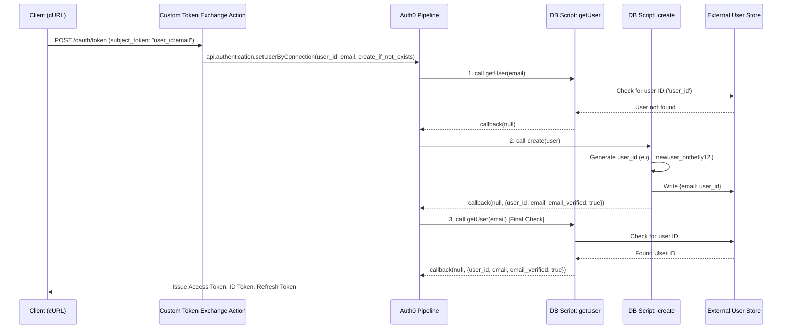

Auth0 User Provisioning via Custom Token Exchange

This documentation describes the logic required in the Auth0 Custom Token Exchange Action and the Custom Database Scripts (getUser and create) to provision users into the Auth0 database without traditional password flows.

This architecture is triggered by calling the /oauth/token endpoint with a custom subject_token.

## Relevant Documentation

For full details on this feature, refer to the official Auth0 documentation:
- [Custom Token Exchange](https://auth0.com/docs/authenticate/custom-token-exchange)
- [Custom Database Script Templates](https://auth0.com/docs/authenticate/database-connections/custom-db/templates)

## Why This Approach Is Useful

This method is ideal when you need to maintain an External Source of Truth for user identity while leveraging Auth0 for authentication flows (Social, Passwordless).

External Identity Linking: If your external database stores existing user records, and users log into Auth0 via a method that doesn't natively link to those records (like a new social login), Custom Token Exchange provides a secure way to automatically link them to the external identity record.

Profile Setup: This approach pulls the external identity information directly into the Auth0 user profile, ensuring profile consistency. Crucially, this process does not exchange credentials; it simply uses a validated, secure token to create a record in Auth0 that points to the external identity.

Note: If you are migrating users completely into Auth0 and will no longer use the external source of truth (meaning the Custom Database connection could use "Import Users to Auth0"), this complex approach is unnecessary.

## Architecture Flow

The entire process is initiated by the Custom Token Exchange Action, which validates the incoming token and calls api.authentication.setUserByConnection. This function triggers the Custom Database Scripts if the user does not exist.

## Sequence Diagram: Successful Provisioning

This diagram illustrates the flow when a new user is created ("provisioned") via the token exchange.

> **Note**: The diagram below uses Mermaid syntax and will render automatically on GitHub. If viewing elsewhere, use a Mermaid-compatible viewer.




# Quick Start

## Prerequisites

- An Auth0 tenant with a Custom Database Connection configured
- Client ID and Client Secret from your Auth0 application
- An external user store (database, API, etc.) to maintain user records

## Setup Instructions

1. **Configure Custom Database Connection**
   - Create a Custom Database Connection in your Auth0 tenant
   - Note the connection name (you'll need this in step 2)

2. **Deploy Custom Token Exchange Action**
   - Navigate to Actions > Custom in your Auth0 dashboard
   - Create a new Custom Token Exchange action
   - Copy the code from `custom_token_exchange_example.js`
   - Update the connection name on line 27 to match your Custom Database Connection
   - Deploy the action

3. **Configure Custom Database Scripts**
   - In your Custom Database Connection settings, configure:
     - **Login script**: Copy code from `get_user_custom_db_example.js`
     - **Create script**: Copy code from `create_user_custom_db_example.js`
   - Implement your external database integration in the marked sections

4. **Test the Token Exchange**

Use the following curl command to test (replace with your values):

```bash
curl --location 'https://YOUR_DOMAIN/oauth/token' \
--header 'Content-Type: application/json' \
--data-raw '{
  "scope": "openid profile email",
  "audience": "YOUR_API_AUDIENCE",
  "client_id": "YOUR_CLIENT_ID",
  "grant_type": "urn:ietf:params:oauth:grant-type:token-exchange",
  "client_secret": "YOUR_CLIENT_SECRET",
  "subject_token": "user123:user123@example.com",
  "subject_token_type": "urn:externalusercreation"
}'
```

**Subject Token Format**: `user_id:email@domain.com`

## Code Files

This repository contains three example files:

1. **Custom Token Exchange Action** - `custom_token_exchange_example.js`
   - Validates the incoming subject_token
   - Extracts user_id and email
   - Triggers user provisioning via `setUserByConnection()`

2. **Custom Database Create Script** - `create_user_custom_db_example.js`
   - Generates a user_id from the email
   - Creates user record in external database
   - Returns user profile to Auth0

3. **Custom Database GetUser Script** - `get_user_custom_db_example.js`
   - Looks up user in external database
   - Returns existing user profile or null (to trigger create)